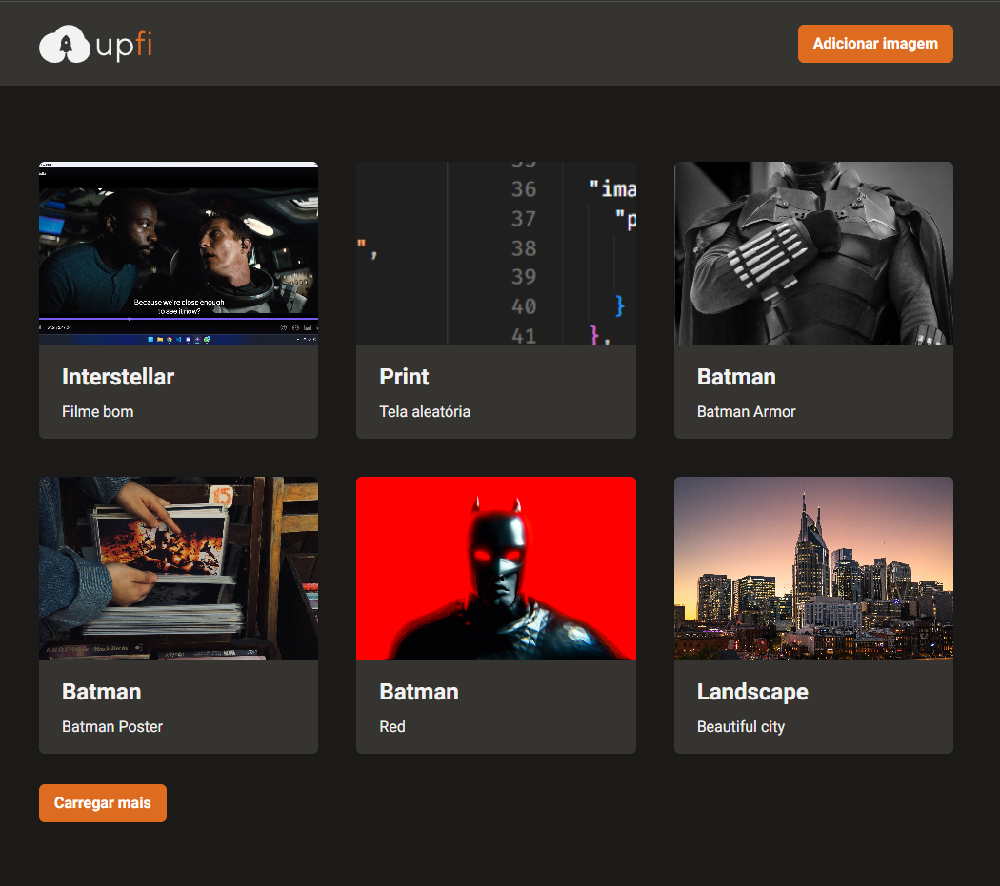

<!-- PROJECT LOGO -->
 

  

  <h3 align="center">upfi</h3>

  

    Image upload and gallery app
  

<!-- ABOUT THE PROJECT -->
## About The Project

[https://upfi-lamongabriel.vercel.app/](https://upfi-lamongabriel.vercel.app/)

 
  
  

UpFi is a basic image upload app developed using NextJS, FaunaDB and ImageBB.
 
FaunaDB is used to store the images datas, links a informations.
 
While ImageBB is responsible for storing the images and provinding a link.
